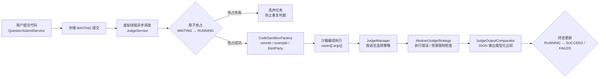

# MyOJ 在线判题系统 · 后端

> 一个像 LeetCode 一样的在线编程判题平台后端：用户提交代码，系统在远程沙箱中隔离执行，自动判定结果。

    

---

## 功能特性

- **多语言判题**：支持 Java、C++、Go、Python、JavaScript，按语言自动选择资源限制策略
- **远程沙箱隔离**：用户代码在独立沙箱中编译执行，后端永不接触用户代码的运行环境
- **异步判题**：基于 Java 21 虚拟线程，提交后立即返回，判题后台执行，不阻塞 HTTP 请求
- **结构化用例**：题目定义输入参数与输出类型，沙箱只做原始编译执行，判题结果由后端类型化比较
- **安全鉴权**：沙箱调用采用 ECDSA 请求签名，防伪造、防重放
- **防重复判题**：`WAITING → RUNNING → SUCCEED | FAILED` 状态机 + 条件更新，保证同一提交只判一次
- **完整的管理能力**：用户注册登录、题目增删改查、提交记录查询、管理员权限（`@AuthCheck` + AOP）
- **开箱即用的接口文档**：Knife4j 在线文档（dev 环境）

## 判题架构



- **代码沙箱**：`CodeSandbox` 接口 + 工厂模式按配置切换实现 + 代理模式做日志增强
- **判题策略**：策略模式管理各语言资源配额，`AbstractJudgeStrategy` 统一执行错误与超限检查
- **结果语义**：提交状态 `SUCCEED` 表示判题流程完成；最终 verdict、首个失败用例或沙箱诊断保存在 `judgeInfo.message`

## 技术栈

| 技术 | 版本 | 用途 |
|------|------|------|
| Java | 21 | 开发语言（虚拟线程异步判题） |
| Spring Boot | 3.5.16 | 基础框架 |
| MyBatis-Plus | 3.5.17 | ORM |
| MySQL | 8.4 | 数据库 |
| Knife4j | 4.4.0 | 接口文档（OpenAPI 3） |
| Hutool | 5.8.47 | 工具库 |
| Docker | - | 一键部署（MySQL + 后端） |

## 快速开始

**前置条件**：JDK 21、Maven 3.6+、MySQL

```bash
# 1. 建库（含默认管理员 admin / 12345678）
mysql -uroot -p < sql/create_table.sql

# 2. 在根目录创建 .env（已被 gitignore，敏感信息不入库）
#    MYSQL_PASSWORD=你的数据库密码
#    CODESANDBOX_AUTH_KEY_ID=sandbox-key-dev-2026
#    CODESANDBOX_AUTH_PRIVATE_KEY=开发沙箱私钥

# 3. 启动
mvn spring-boot:run
```

访问接口文档：http://localhost:8102/api/doc.html

## Docker 部署

```bash
mvn clean package
cp target/my-oj-0.0.1.jar deploy/oj-backend/my-oj.jar
cd deploy
# 准备 .env：MYSQL_ROOT_PASSWORD / MYSQL_PASSWORD / CODESANDBOX_URL / CODESANDBOX_AUTH_KEY_ID / CODESANDBOX_AUTH_PRIVATE_KEY
docker compose up -d
```

MySQL（3307）+ 后端（8101）一键启动，prod profile 下接口文档与 SQL 日志默认关闭。

## 项目结构

```
src/main/java/com/hjl/oj/
├── controller/        # HTTP 接口层
├── service/           # 业务逻辑层
├── judge/             # 判题模块（核心）
│   ├── codesandbox/   # 代码沙箱：工厂 + 代理模式
│   └── strategy/      # 判题策略：策略模式
├── mapper/            # MyBatis-Plus 数据访问层
├── model/             # dto / entity / enums / vo
├── aop/               # 权限校验切面（@AuthCheck）
├── config/            # 配置类（CORS、JSON 等）
└── common/            # 统一返回、错误码
```

## 更多文档

- [沙箱调用鉴权说明](./docs/sandbox-auth/README.md)（ECDSA 签名）
- [沙箱资源隔离方案](./docs/sandbox-resource-isolation.md)
- [数据库建表脚本](./sql/create_table.sql)

## License

[MIT](./LICENSE)
